登录完首页

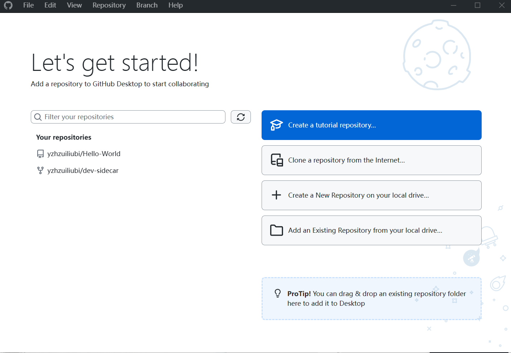

## 从远端克隆一个仓库到本地

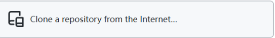

### Github.com, 表示从自己的从库下载到本地

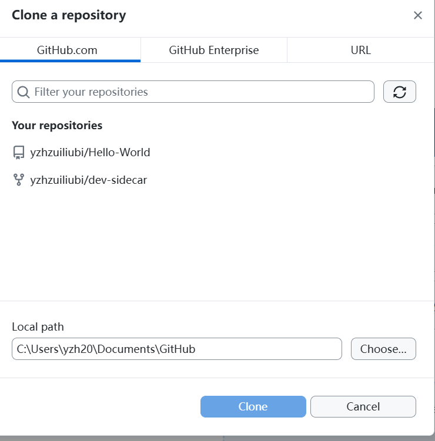

### 使用 URL 的方式克隆任意一个从仓库 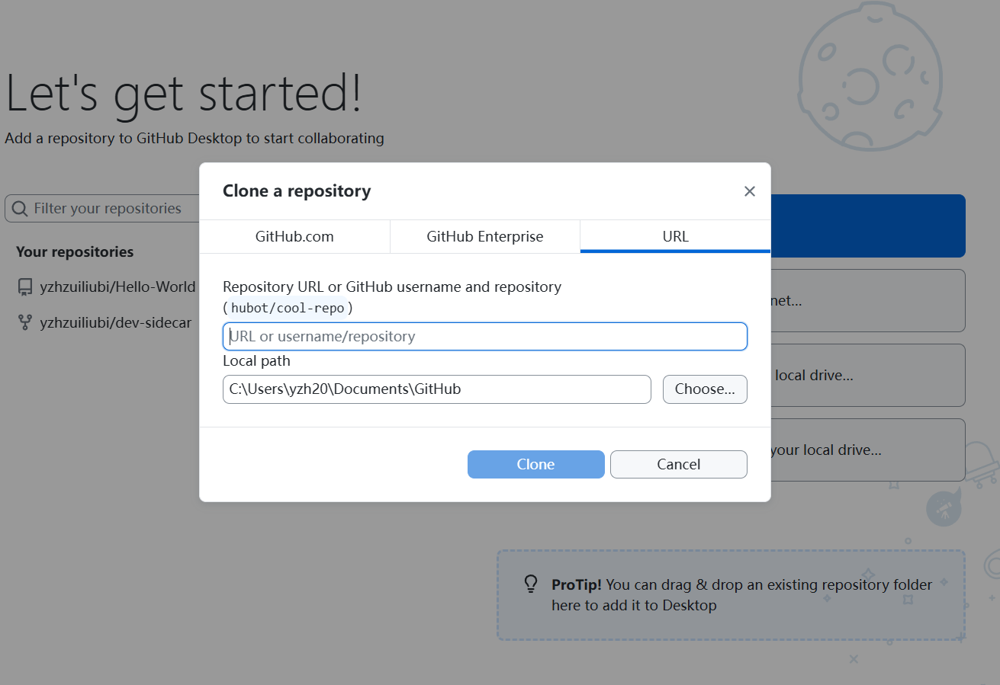

下载到本地之后

找到.git 的文件夹，

#### objects 文件夹，用于存储对象，一般有三种对象：

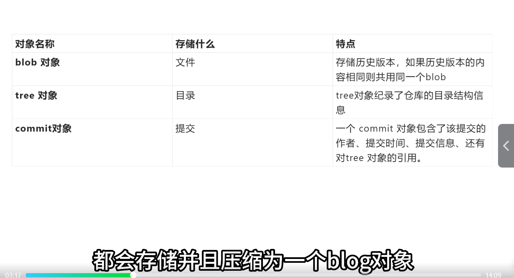

一般都在 objects/pack/目录下

#### refs 文件夹

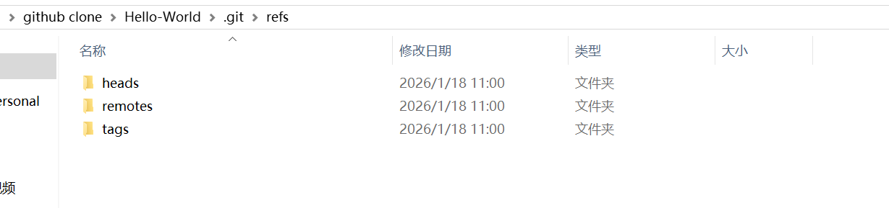

- `heads`

  ：存放本地分支的引用。

  每一个文件对应一个本地分支，文件里记录着该分支当前指向的 commit 的哈希值。

- `remotes`

  ：存放远程仓库分支的引用。

  里面会按远程仓库名（比如

  ```
  origin
  ```

  ）再分目录，记录着你本地跟踪的远程分支的最新 commit 哈希。

- `tags`

  ：存放标签的引用。

  

  标签通常用来标记重要的版本节点（如

   

  ```
  v1.0.0
  ```

  ），这里的文件记录着标签对应的 commit 哈希。

**heads 里面的吗 main 文件夹下打开里面存放着，最后一次 commit 时提交的哈希值，如下图所示**

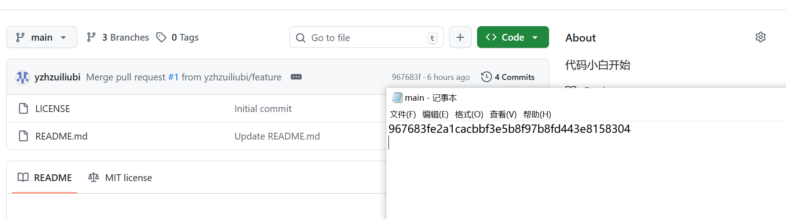

#### 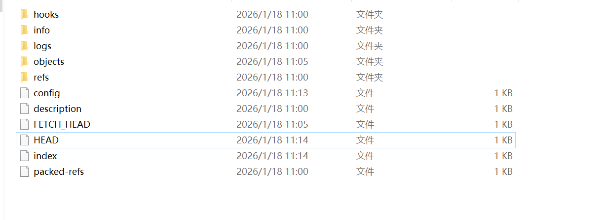

`HEAD` 是一个 **指针文件**，它指向你当前工作目录所在的分支或提交。你可以把它理解成 “你现在在哪里工作” 的标记。

##### 分离指针（detached HEAD）

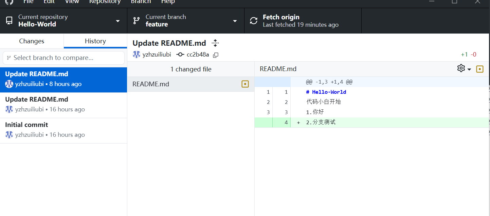

右键点击 Checkout commit

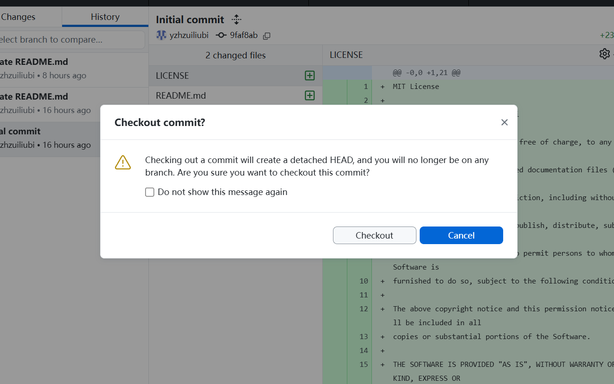

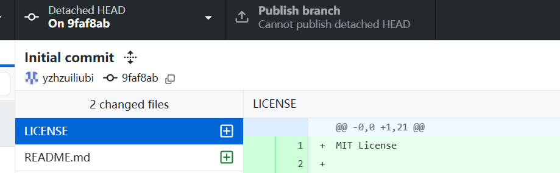

如标签栏 Detached HEAD 表示现在不属于任何一个分支，

**Detached HEAD（分离 HEAD 状态）** 是 Git 里一个非常实用的特性，它主要用来在不影响现有分支的情况下，直接操作历史提交或临时代码。

##### 切换回原来的分支

直接切换到你之前工作的分支（比如 `main`），就能自动退出分离 HEAD 状态，回到正常分支：

### config 文件

Git 仓库里的 `.git/config` 文件是这个仓库的 **本地配置文件**，它存储了当前仓库特有的设置，不会影响你电脑上的其他 Git 仓库。我来给你拆解一下它的主要内容和作用：

------

### 📝 核心内容结构

这个文件是 INI 格式，通常包含以下几个关键部分：

1. **`[core]` 核心配置**

   这部分定义了仓库的基础行为。

   ```ini
   [core]
       repositoryformatversion = 0
       filemode = false
       bare = false
       logallrefupdates = true
       symlinks = false
       ignorecase = true
   ```
   
   - `filemode`：在 Windows 上通常为 `false`，因为 Windows 不区分文件的可执行权限。
   - `ignorecase`：在 Windows/macOS 上通常为 `true`，让 Git 忽略文件名大小写的变化。
   - `bare`：`false` 表示这是一个可以工作的仓库，`true` 则是一个只存 Git 数据的裸仓库。
   
2. # **`[remote]` 远程仓库配置**         重要

   记录了你连接的远程仓库信息（比如 `origin`）。

   ```ini
   [remote "origin"]
       url = https://github.com/yzhzuiliubi/Hello-World.git//
       fetch = +refs/heads/*:refs/remotes/origin/*
   ```
   
   - `url`：远程仓库的地址（HTTPS 或 SSH 形式）。
   - `fetch`：指定本地要跟踪的远程分支规则，`+refs/heads/*:refs/remotes/origin/*` 表示拉取所有远程分支到本地的 `origin/` 命名空间下。
   
3. **`[branch]` 分支跟踪配置**

   定义本地分支与远程分支的关联关系。

   ```ini
[branch "main"]
       remote = origin
       merge = refs/heads/main
   ```
   
   这表示本地的 `main` 分支会跟踪 `origin` 远程的 `main` 分支，执行 `git pull`/`git push` 时会默认和这个远程分支交互。

4. **`[user]` 身份配置（可选）**

   如果在当前仓库单独设置了用户名和邮箱，会在这里显示，它会覆盖你的全局 Git 配置。

   ```ini
   [user]
       name = Your Name
       email = your.email@example.com
   ```

------

💡 实用小技巧

- 查看配置

  ：你可以用命令行直接查看，避免手动打开文件：

  bash

  ```bash
  git config --local --list
  ```

- 修改配置

  ：推荐用 Git 命令修改，比手动编辑更安全：

  bash

  ```bash
  # 例如修改远程仓库地址
  git remote set-url origin git@github.com:yzhzuiliubi/Hello-World.git
  ```

- **优先级**：这个本地配置的优先级 > 你的全局 Git 配置（`~/.gitconfig`）。

## 本地创建新分支，上传到远程

点击 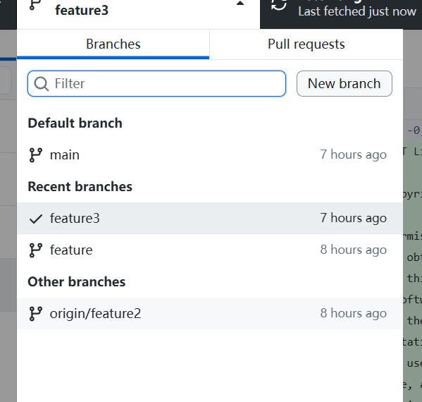

然后点击 publish branch，实现远端同步

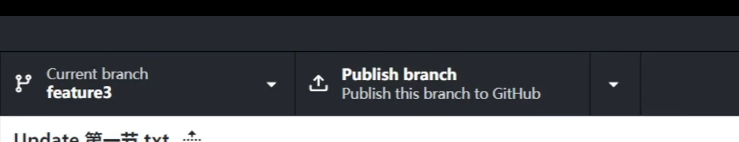

## 在网页创建分支，本地下载

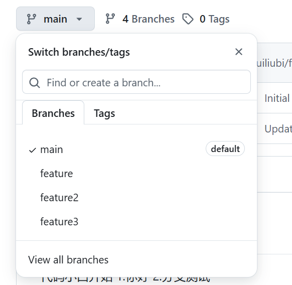

点击 view all branches

再点击 new branch

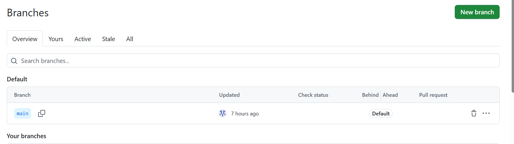

最后点击 Fetch origin, 将网页端的分支下载到本地 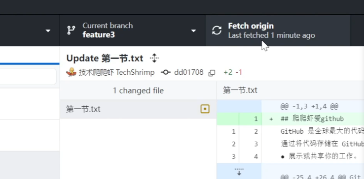

## 使用 desktop GitHub 克隆别人的项目

点击 add ，点击 clone  respository，点击 URL 即可下载别人的项目 

## 本地文件夹上传成仓库

### 点击仓库下拉列表

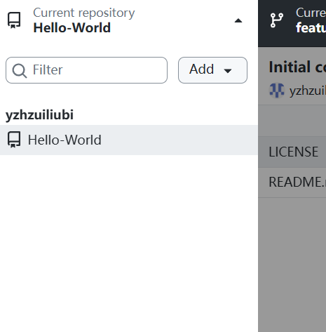

### 点击 add，点击 create new repository

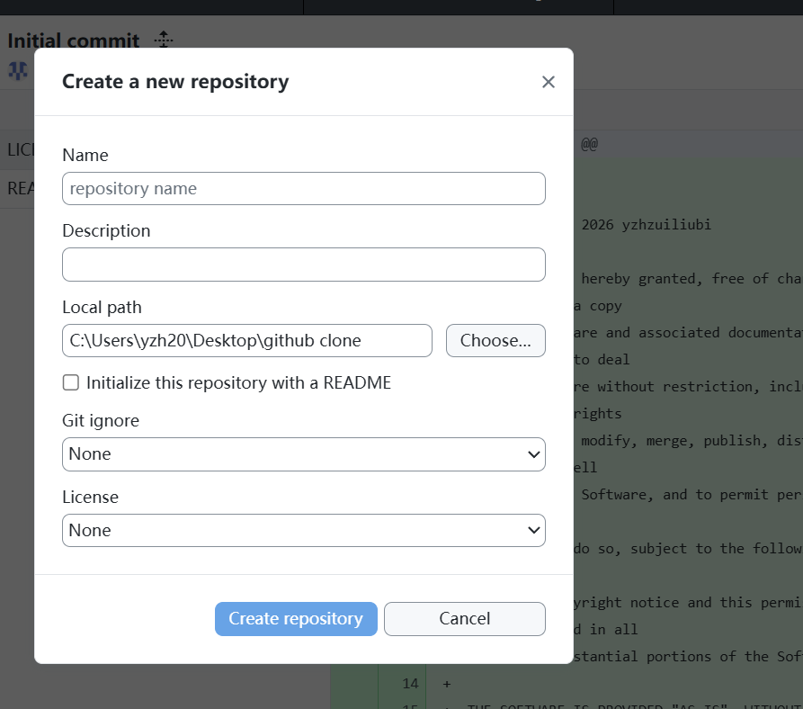

依次按要求填写完毕就行

