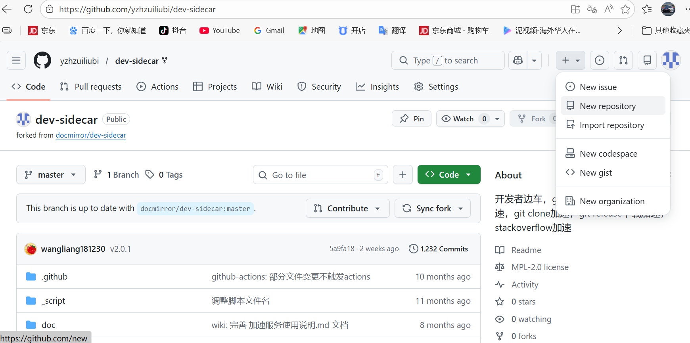

点击+号，点击 new repository

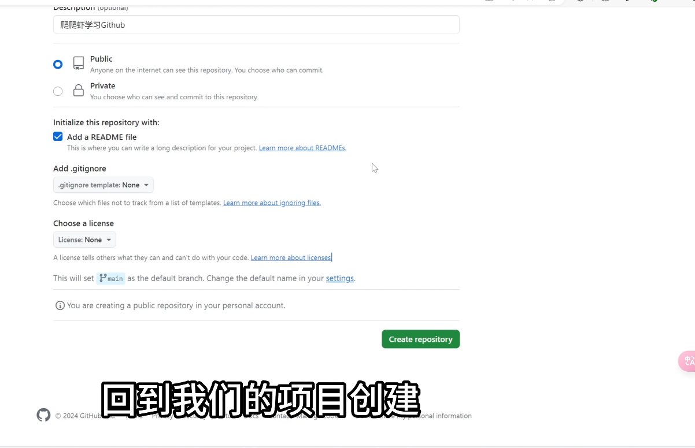

有以下开源协议

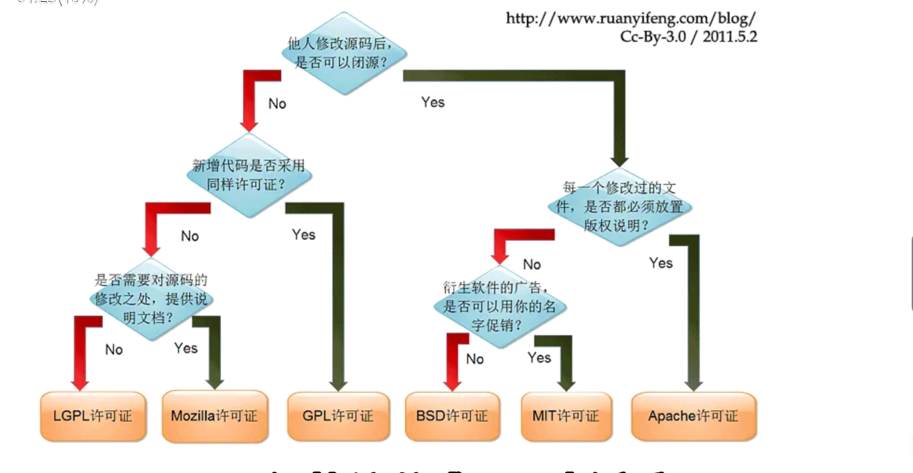

## 点击 readme 文件点击右上角的小铅笔图标后可是用 markdown 语法进行编写

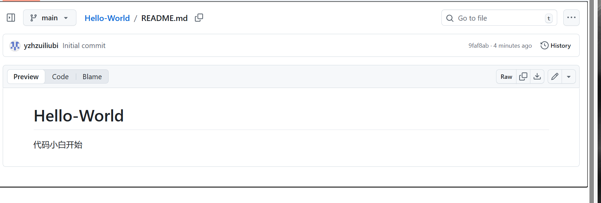

编写完毕就可以点击 commit changes 上传本次修改

## 回到项目首页可以看见 commits 的个数（多少次上传，提交历史）

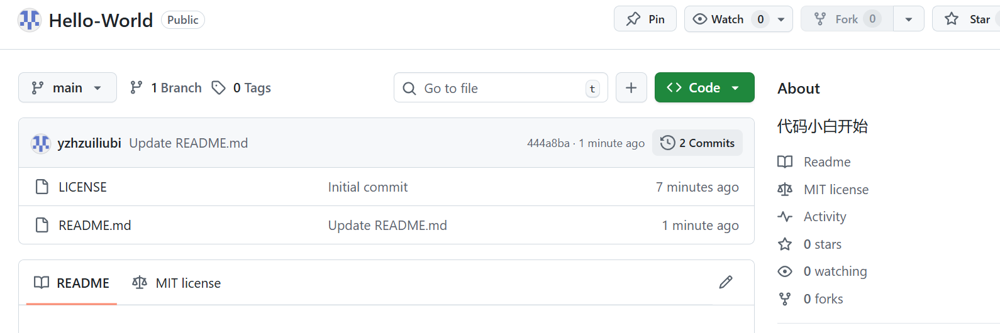

点击 commits 可以看见每次提交的具体时间

点击具体的 commits 还可以看见哪些内容被修改(绿色部分)

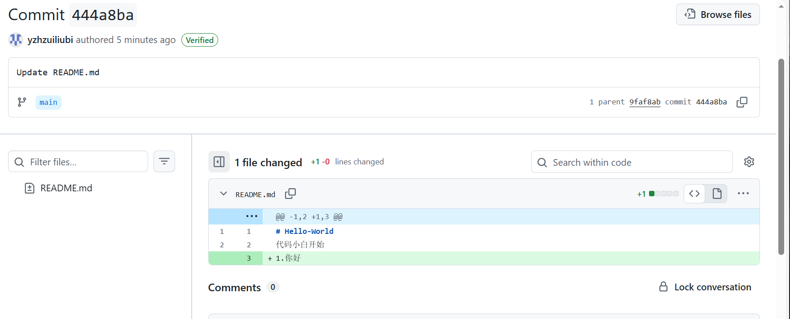

### verified** 表示此次上传是通过网页上传的

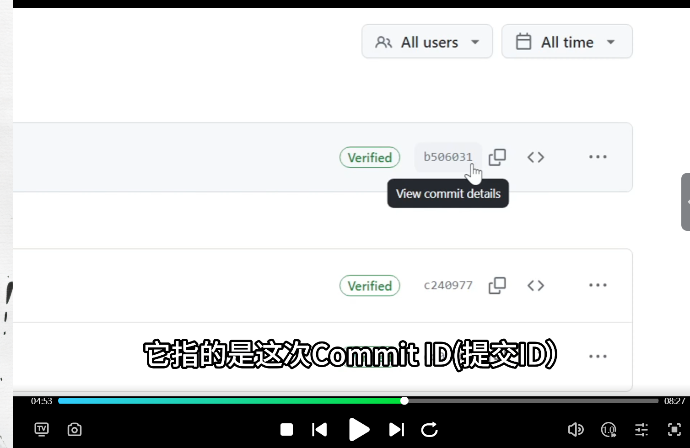

### 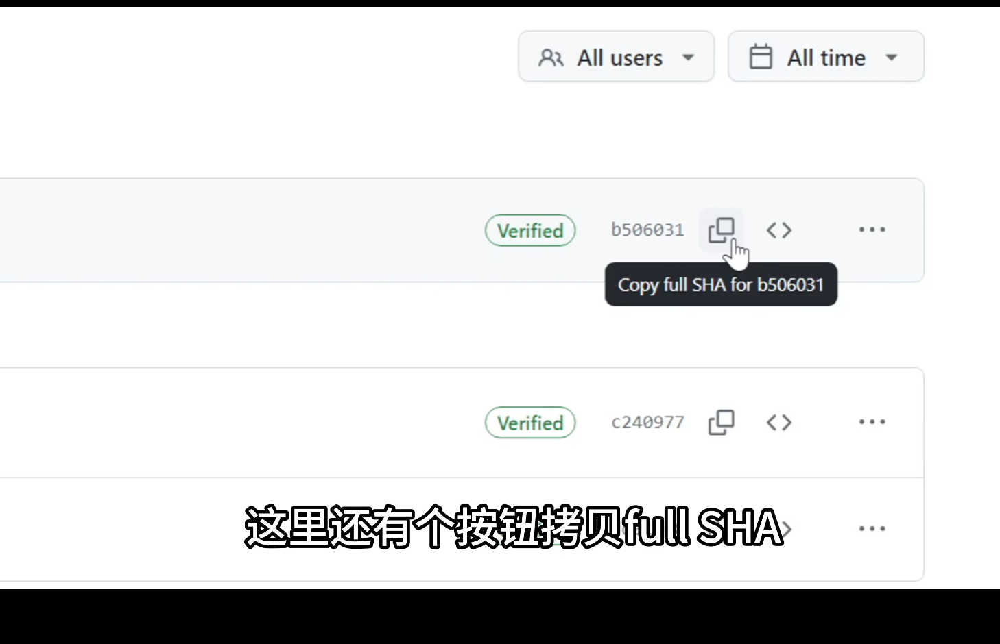

表示拷贝这个长 id

## 点击 <> 可以查看仓库的历史状态 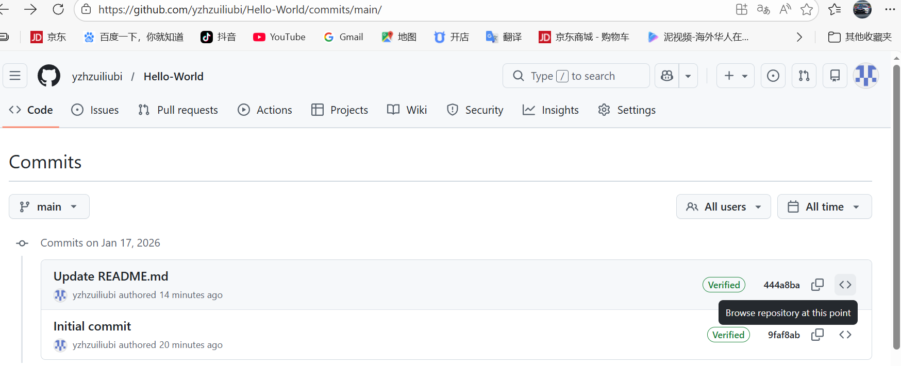

## 上传文件

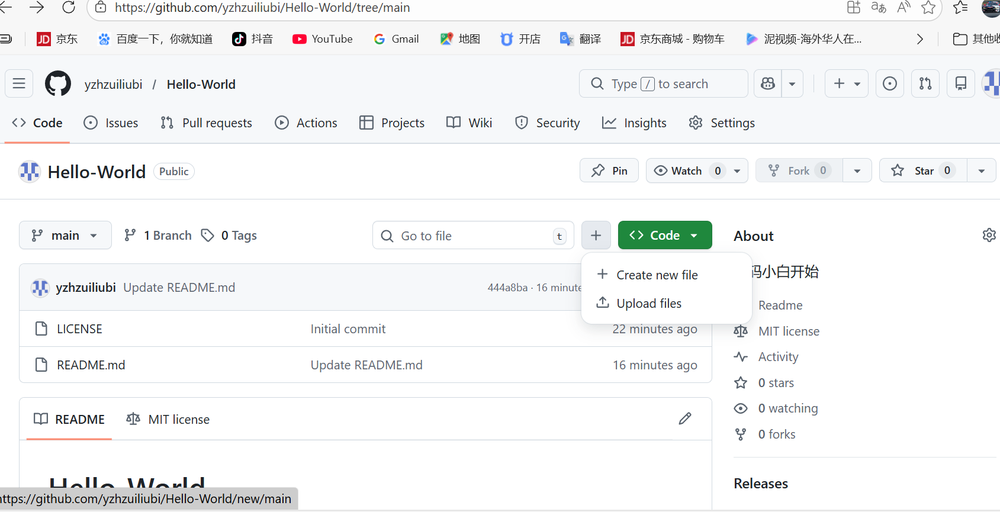

### 点击+号可以选择创建新文件或者上传自己的文件

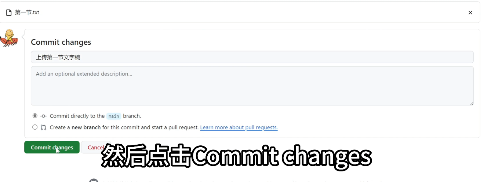

### GitHub gist （小型仓库，一般上传单一代码）点击右上角加号点击 new gist

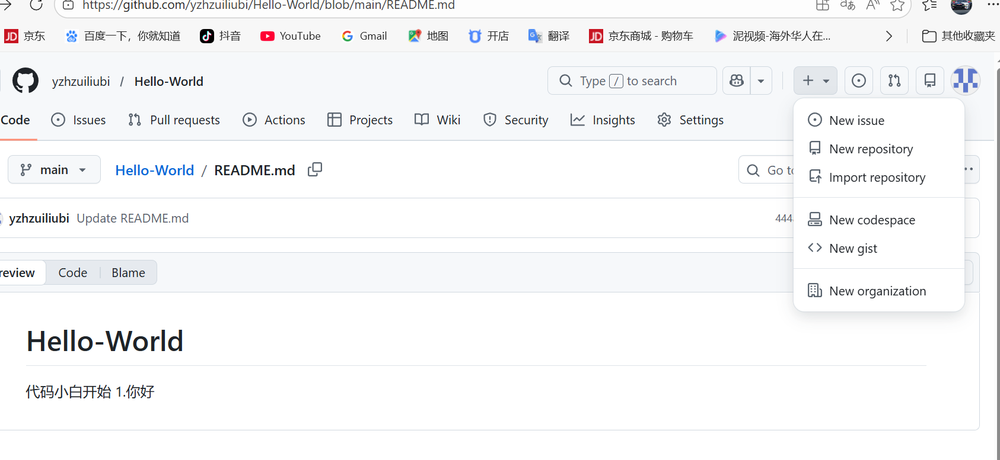

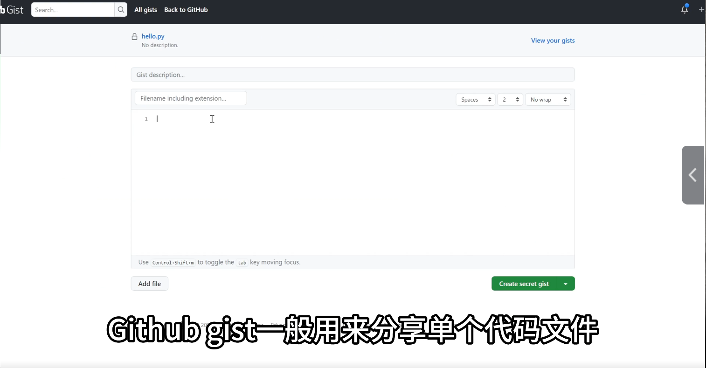

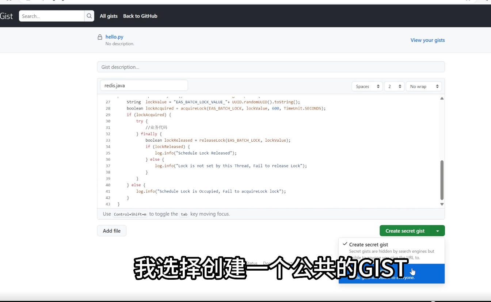

#### 分享方式

##### 第一种：**embed**

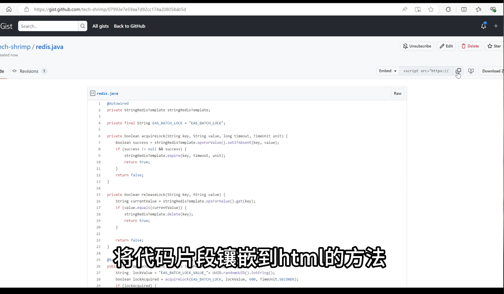

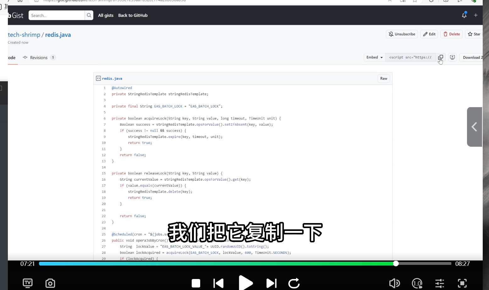

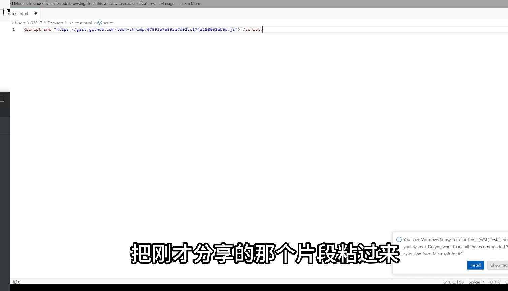

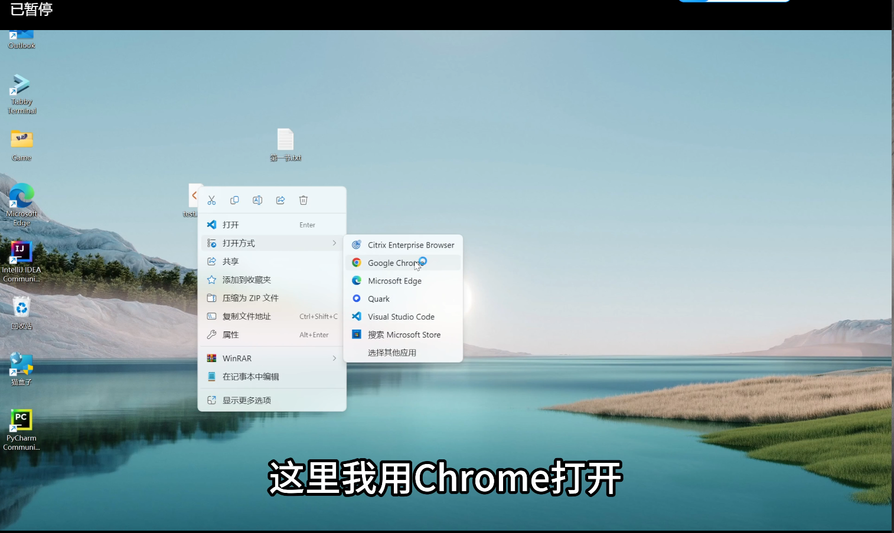

##### 第二种：**share**，复制链接，打开链接即可查看

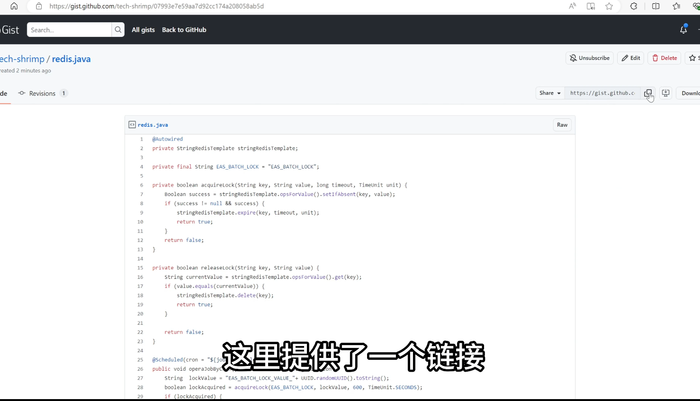
