## explore（右上角 open menu 那点开·）

其中 trending repositories 是每日热点还有下面的是根据个人的推荐

点击下面的 See more trending repositories](https://github.com/trending)

可以根据语言进行筛选项目（Spoken language）

还可以根据编程语言进行筛选 language

## [Search](https://github.com/search)

可以搜索项目

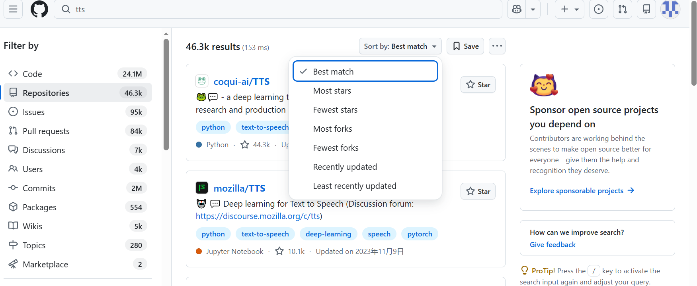

sort by 可以根据不同的排序方式进行排序

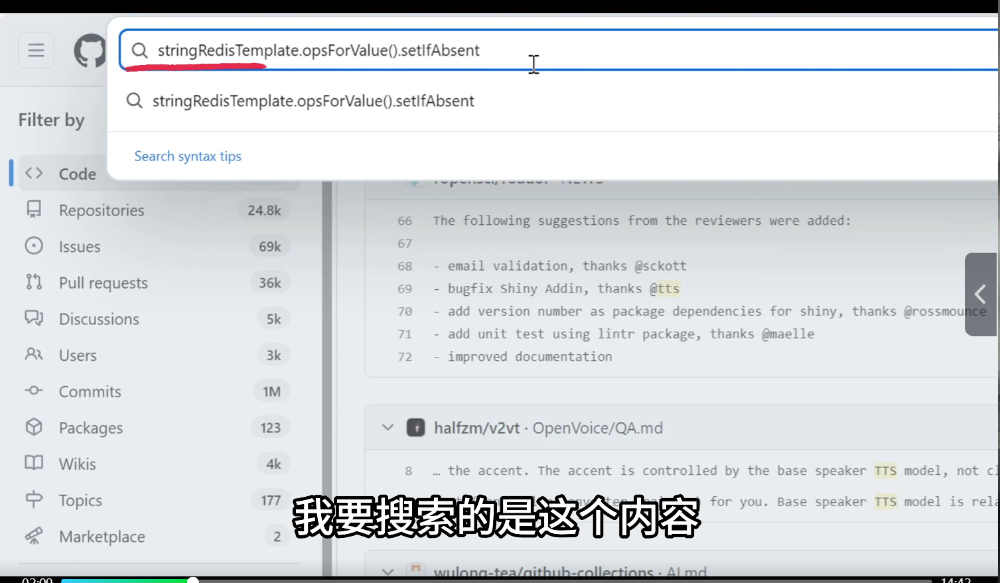

还可以选择 code 根据代码进行搜索，

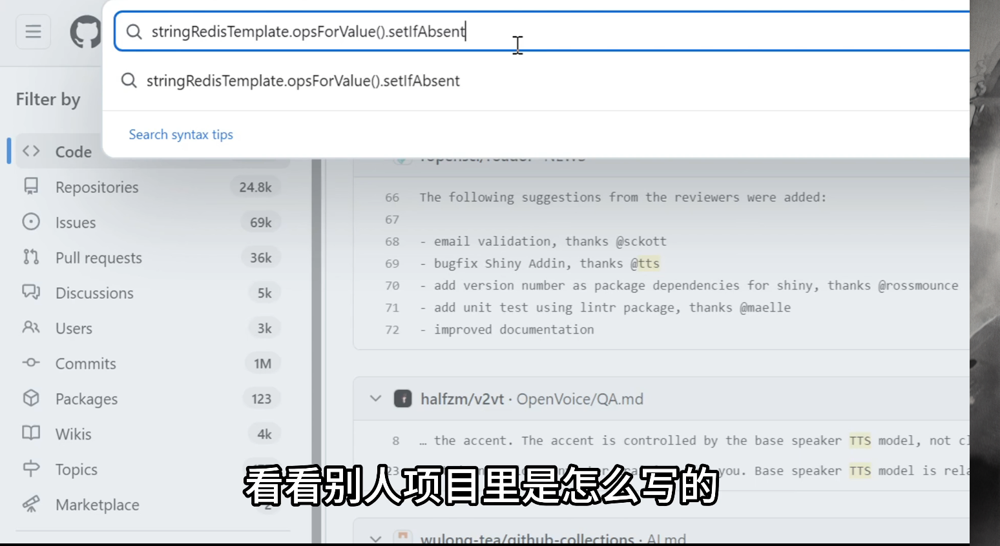

## 进阶搜索 [advanced search](https://github.com/search/advanced)

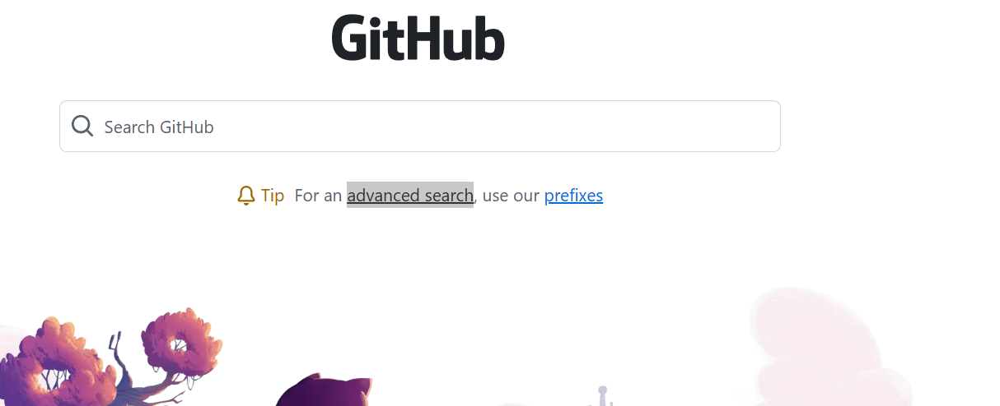

这部分带过（高级搜索语法）

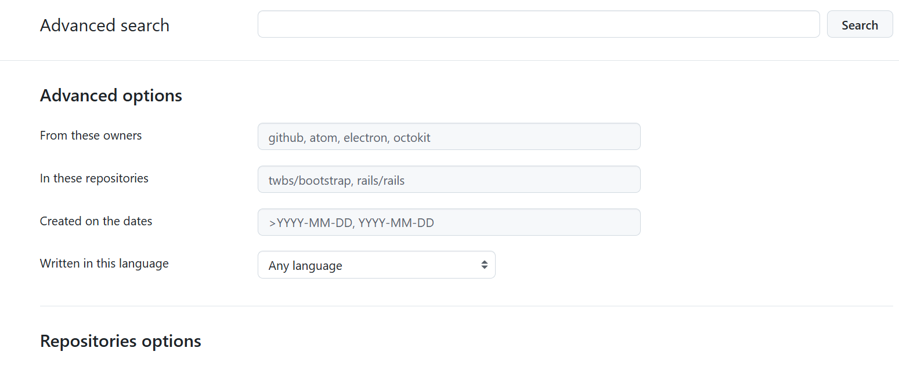

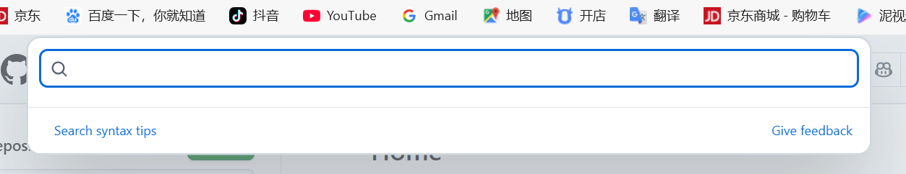

有需要可以查看 GitHub 的搜索文档介绍

### 重要的几个

#### 使用正则表达式搜索 

/sparse,*index/表示以 sparse 开头以 index 结尾的

#### 以逻辑符进行搜索

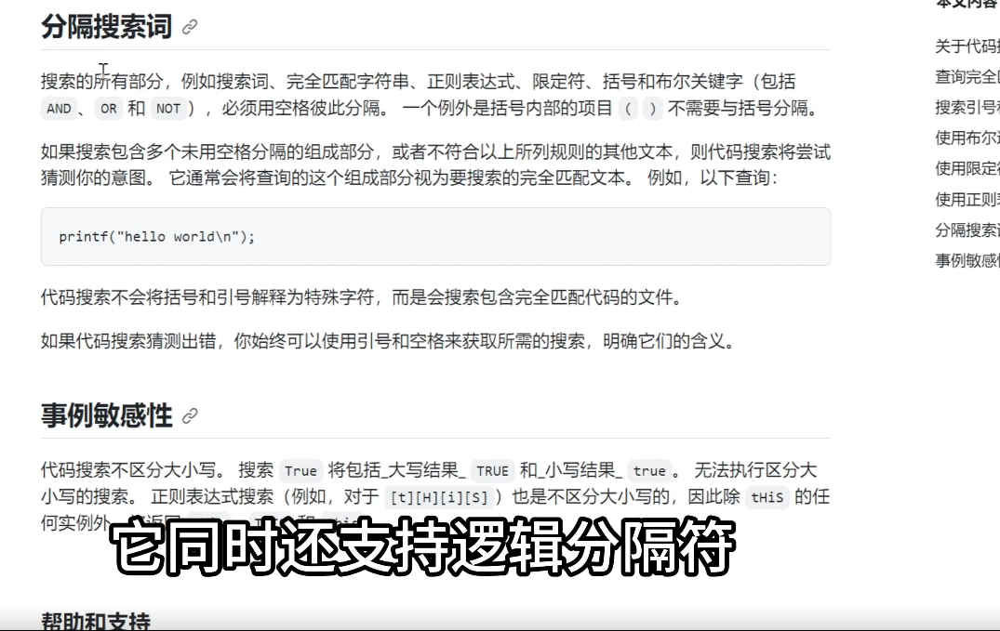

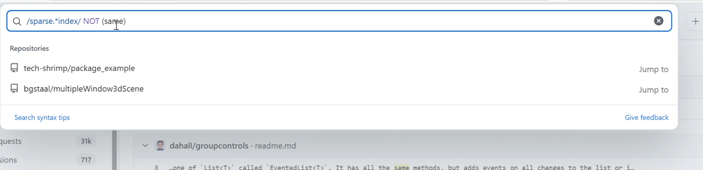

## 关注功能

### 点击 star 进行收藏

进入如下网址可以查看自己的已收藏项目

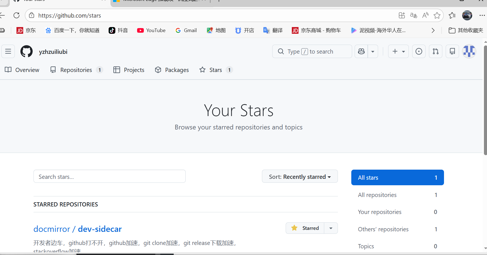

### 点击 Watch

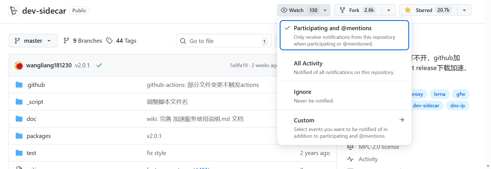

点击 custom 可以选择 releases 当有新版本发布时可以在邮箱收到信息

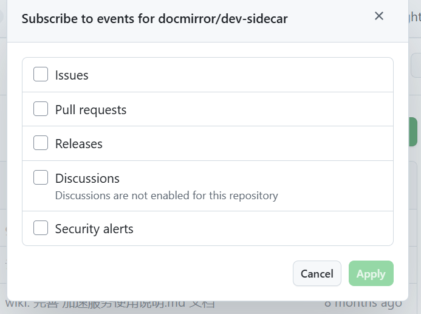

### 关注作者

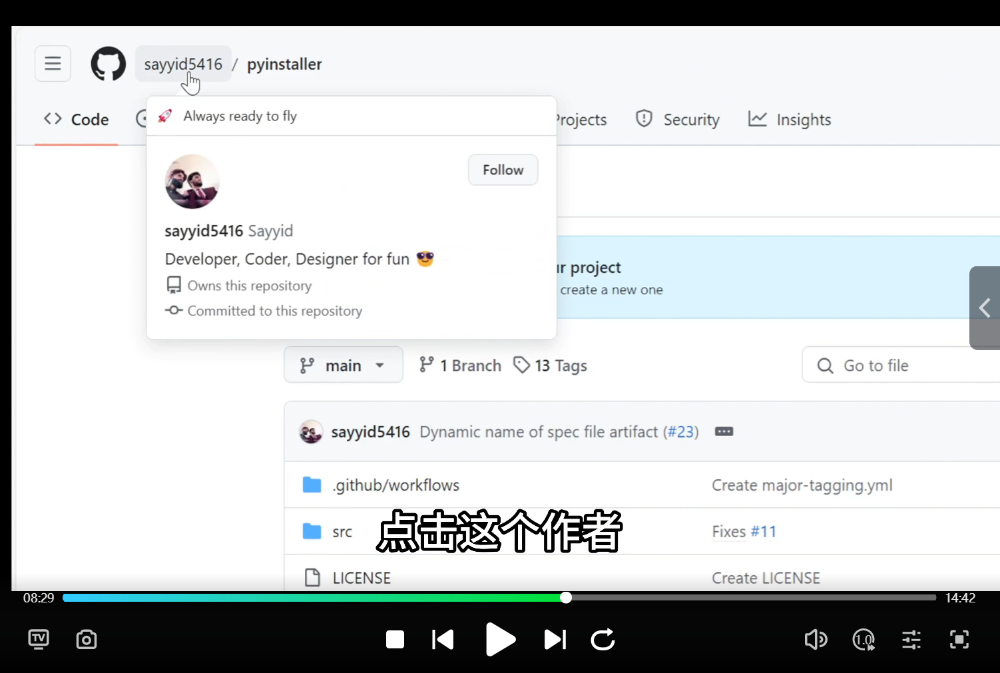

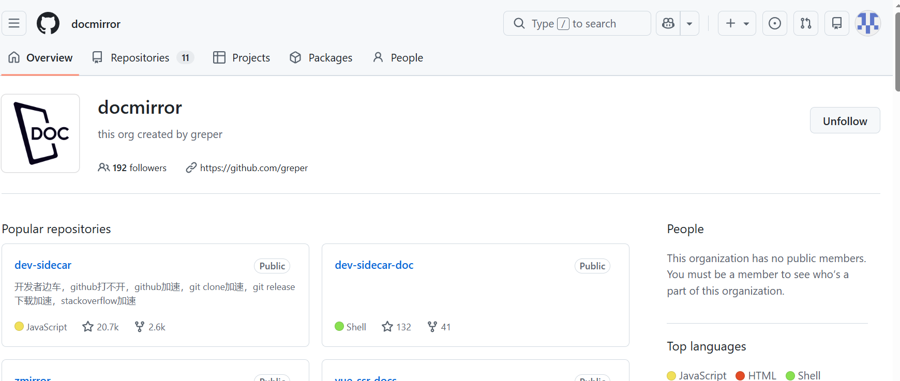

点击 follow

## 源代码下载

### 点击 Code，再点击 Download ZIP

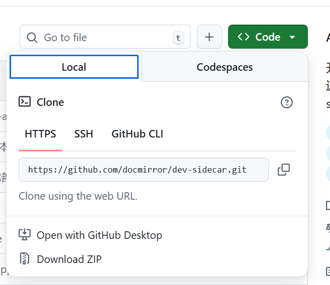

### 克隆

### fork，将项目保存到自己名下

点击 sync fork，将木项目的代码同步到我的子项目中

## 下载并使用软件

### releases

其中的命名规则是：第一部分是软件的名字，第二版本号，操作系统，cup架构，

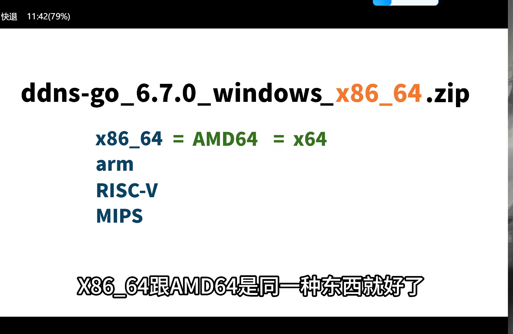

### 没有releases，去about上看有没有官网的信息或者演示页面

### 使用docker

### 一键部署

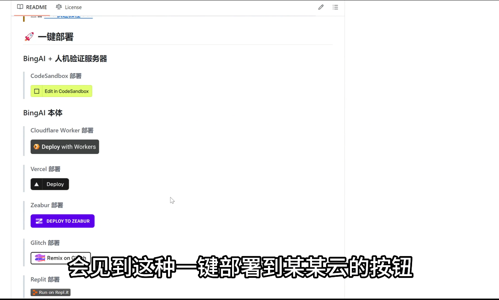

